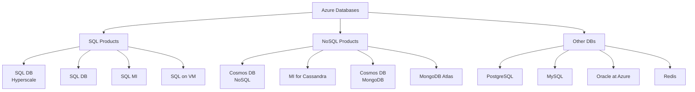

# Azure Databases Advisor \&   Unifying Data Governance with Microsoft Purview - Overview 
Last updated: 2025-07-17

----------

<b>Table of Content</b> (Click to expand)

  
- [Overview](#overview)
- [Products/Services](#productsservices)

> [!IMPORTANT]
> The [Azure Databases Advisor Tool](https://microsoftcloudessentials-learninghub.github.io/Azure-Databases-Purview-Advisor/) is designed to help users select the most suitable Azure database service based on their specific use case. It provides recommendations by analyzing user inputs such as data type, scalability needs, latency requirements, and more.
> The information provided and any document (such as scripts, sample codes, etc.) is provided `AS-IS` and `WITH ALL FAULTS`. Pricing estimates are for `demonstration purposes only and do not reflect final pricing`. `Microsoft assumes no liability` for your use of this information and makes no guarantees or warranties, expressed or implied, regarding its accuracy or completeness, including any pricing details. `Please note that these demos are intended as a guide and are based on personal experiences.`

## Overview 

  

<b>Details</b> (Click to expand)

> - **Formats** 
>   - Structured: Stored in predefined formats like rows and columns with consistent schema enforcement. 
>   - Unstructured: Exists in diverse formats like free text, images, audio, video, and documents that lack a formal structure. 
> - **Storage Model** 
>   - Structured: Uses rigid, predefined schemas in relational databases ensuring integrity and data validation. 
>   - Unstructured: Stored in flexible formats such as object storage, document stores, or blob storage without a fixed schema. 
> - **Databases** 
>   - Structured: Managed through SQL-based systems like Azure SQL, MySQL, and PostgreSQL. 
>   - Unstructured: Supported by NoSQL systems like Cosmos DB, MongoDB, and cloud-native data lakes. 
> - **Ease of Search** 
>   - Structured: Easily queried using SQL, indexing, and standardized query languages. 
>   - Unstructured: Requires more advanced approaches like keyword extraction, OCR, or AI-assisted search tools. 
> - **Analysis Methods** 
>   - Structured: Suited for quantitative techniques, including statistical modeling, trend analysis, and aggregation. 
>   - Unstructured: Often analyzed with qualitative approaches like NLP, sentiment analysis, topic modeling, or deep learning. 
> - **Tools and Technologies** 
>   - Structured: RDBMS (SQL Server, Oracle), OLTP systems, CRM platforms, and OLAP tools for analytics. 
>   - Unstructured: NoSQL DBMS, data mining frameworks, ML pipelines, AI services, and visualization platforms like Power BI. 
> - **Specialists** 
>   - Structured: Typically handled by business analysts, software engineers, solution architects, and DBAs. 
>   - Unstructured: Requires data scientists, AI/ML specialists, information architects, and advanced data engineers. 

## Products/Services 

<b>Azure SQL Database</b> (PaaS) - Click to expand 

> Fully managed PaaS Database Engine that automates upgrades, patching, backups, and monitoring.

> - **Benefits:** Reduces management overhead and total cost of ownership. 
> - **Differentiators:** Built-in high availability, scalability, and security. 
> - **Use Cases:** Ideal for modern cloud applications requiring performance, scale, and low operational maintenance. 
> - **Related Products:** Azure App Service, Power BI, Azure Analysis Services. 

Click here to read more about a [quick guide on Azure SQL Database](./sql/azure-sql-database/)
 

<b>Azure SQL Managed Instance</b> (PaaS) - Click to expand 

> Fully managed SQL Server instance with near-complete compatibility with on-premises SQL Server.

> - **Benefits:** Simplifies migration from on-premises without code changes. 
> - **Differentiators:** Supports SQL Server Agent, linked servers, and cross-database transactions. 
> - **Use Cases:** Enterprise app migrations from legacy environments. 
> - **Related Products:** Azure Data Factory, Azure Databricks, Azure Synapse Analytics. 

Click here to read more about a [quick guide on Azure SQL Managed Instance](./sql/azure-sql-managed-instance)

<b>SQL Server on Azure Virtual Machines</b> (IaaS) - Click to expand 

> SQL Server running on Azure VMs, offering full OS-level access and control.

> - **Benefits:** Offers flexibility and customization for apps with unique OS or database dependencies. 
> - **Differentiators:** Supports specialized SQL Server features not available in PaaS offerings. 
> - **Use Cases:** Best for lift-and-shift migrations requiring full control and legacy support. 
> - **Related Products:** Azure Backup, Azure Site Recovery, Azure Monitor. 

Click here to read more about a [quick guide on SQL Server on Azure Virtual Machines](./sql/sql-server-on-azure-vm)

<b>Azure Database for PostgreSQL</b> (PaaS) - Click to expand 

> Enterprise-ready community PostgreSQL database service, fully managed by Microsoft.

> - **Benefits:** High availability with up to 99.99% SLA, built-in security, and scalability. 
> - **Differentiators:** Supports PostgreSQL extensions and advanced indexing options. 
> - **Use Cases:** Cloud-native applications using PostgreSQL frameworks like Django or Flask. 
> - **Related Products:** Azure Kubernetes Service, Azure App Service, Power BI. 

Click here to read more about a [quick guide on Azure Database for PostgreSQL](./sql/azure-database-for-postgresql)

<b>Azure Database for MySQL</b> (PaaS) - Click to expand 

> Managed MySQL service providing open-source compatibility and built-in scaling.

> - **Benefits:** Automatic backups, patching, high availability, and zone redundancy. 
> - **Differentiators:** Community edition with scalable performance tiers. 
> - **Use Cases:** Applications using PHP, Ruby, or Node.js; WordPress and ecommerce platforms. 
> - **Related Products:** Azure Web Apps, Azure Functions, Azure Logic Apps. 

Click here to read more about a [quick guide on Azure Database for MySQL](./sql/azure-database-for-mysql)

<b>Oracle Database on Azure</b> (IaaS) - Click to expand 

> Enables customers to run Oracle workloads directly on Azure infrastructure.

> - **Benefits:** Leverages existing Oracle licenses and integrations with Azure services. 
> - **Differentiators:** Official Oracle support with flexible deployment topologies. 
> - **Use Cases:** Running core enterprise Oracle applications with high availability. 
> - **Related Products:** Azure Site Recovery, Azure Backup, Azure Active Directory. 

Click here to read more about a [quick guide on Oracle Database on Azure](./sql/oracle-database-on-azure)

<b>SQL Server 2022</b> (IaaS) - Click to expand 

> Latest release of SQL Server with built-in hybrid and cloud-connected capabilities.

> - **Benefits:** Brings innovations like ledger tables, Synapse Link, and built-in security enhancements. 
> - **Differentiators:** Full hybrid flexibility for modern apps with backward compatibility. 
> - **Use Cases:** Enterprise apps requiring up-to-date SQL features and strong cloud connectivity. 
> - **Related Products:** Azure Synapse Analytics, Power BI, Azure Data Factory. 

Click here to read more about a [quick guide on SQL Server 2022](./sql/sql-server-2022)

<b>Azure Cosmos DB</b> (PaaS) - Click to expand 

> Globally distributed, multi-model NoSQL database for ultra-low latency and high throughput.

> - **Benefits:** Turnkey global replication, automatic scaling, and multi-region writes. 
> - **Differentiators:** Supports multiple APIs (SQL, MongoDB, Cassandra, Gremlin, Table). 
> - **Use Cases:** IoT, retail, gaming, real-time personalization, and telemetry apps. 
> - **Related Products:** Azure Functions, Azure Logic Apps, Azure Container Instances. 

Click here to read more about a [quick guide on Azure Cosmos DB](./nosql/azure-cosmos-db)

<b>Azure Managed Instance for Apache Cassandra</b> (PaaS) - Click to expand 

> Managed Cassandra database service designed for massive scale and availability.

> - **Benefits:** Built-in automation, scalability, and hybrid deployment options. 
> - **Differentiators:** Supports native Cassandra drivers and schemas with Azure-managed benefits. 
> - **Use Cases:** Wide-column workloads such as product catalogs, fraud detection, and event monitoring. 
> - **Related Products:** Azure Synapse Analytics, Azure HDInsight, Azure Databricks. 

Click here to read more about a [quick guide on Azure Managed Instance for Apache Cassandra](./nosql/azure-managed-instance-for-apache-cassandra)

<b>Azure Cosmos DB for MongoDB</b> (PaaS)

> Fully managed implementation of MongoDB using Cosmos DB’s global infrastructure.

> - **Benefits:** Globally available with strong SLAs and elastic scalability. 
> - **Differentiators:** Offers wire protocol compatibility with native MongoDB SDKs and tools. 
> - **Use Cases:** Web apps, content management, cataloging, and personalized recommendation engines. 
> - **Related Products:** Azure Kubernetes Service, Azure Databricks, Azure Functions. 

Click here to read more about a [quick guide on Azure Cosmos DB for MongoDB](./nosql/azure-cosmos-db-for-mongodb)

<b>MongoDB Atlas on Azure</b> (SaaS) - Click to expand 

> Official managed MongoDB service deployed in Azure’s cloud infrastructure.

> - **Benefits:** High automation, operational best practices, and global clusters. 
> - **Differentiators:** Offers native integration with MongoDB features and support from MongoDB Inc. 
> - **Use Cases:** Mobile and IoT apps, gaming, metadata management, and logging platforms. 
> - **Related Products:** Azure Kubernetes Service, Azure Databricks, Azure Functions. 

Click here to read more about a [quick guide on MongoDB Atlas on Azure](./nosql/mongo-db-atlas-on-azure)

<b>Azure Cache for Redis</b> (PaaS) - Click to expand 

> In-memory data store used for caching, messaging, and fast key-value operations.

> - **Benefits:** Ultra-low latency and high throughput data access. 
> - **Differentiators:** Fully managed Redis with security, scaling, and geo-replication. 
> - **Use Cases:** Session stores, real-time leaderboards, background task queues. 
> - **Related Products:** Azure Web Apps, Azure Functions, Azure Logic Apps. 

Click here to read more about a [quick guide on Azure Cache for Redis](./nosql/azure-cache-for-redis)

<!-- START BADGE -->

  
  
Refresh Date: 2025-07-17

<!-- END BADGE -->
